## 📑 1. ps aux

Explanation:
a → show processes for all users
u → show user/owner of process
x → show processes not attached to a terminal
Example Output:

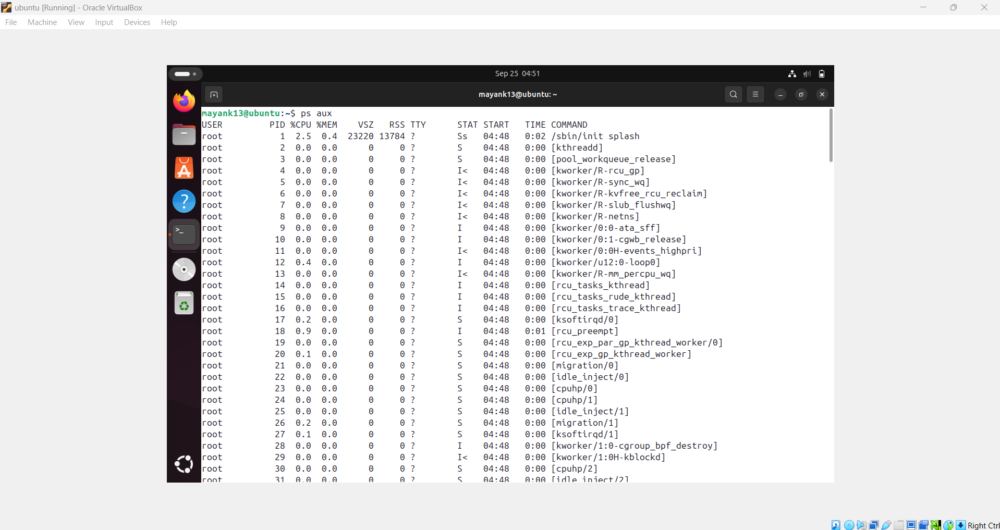

---

## 🌲 2. Process Tree

command - pstree -p

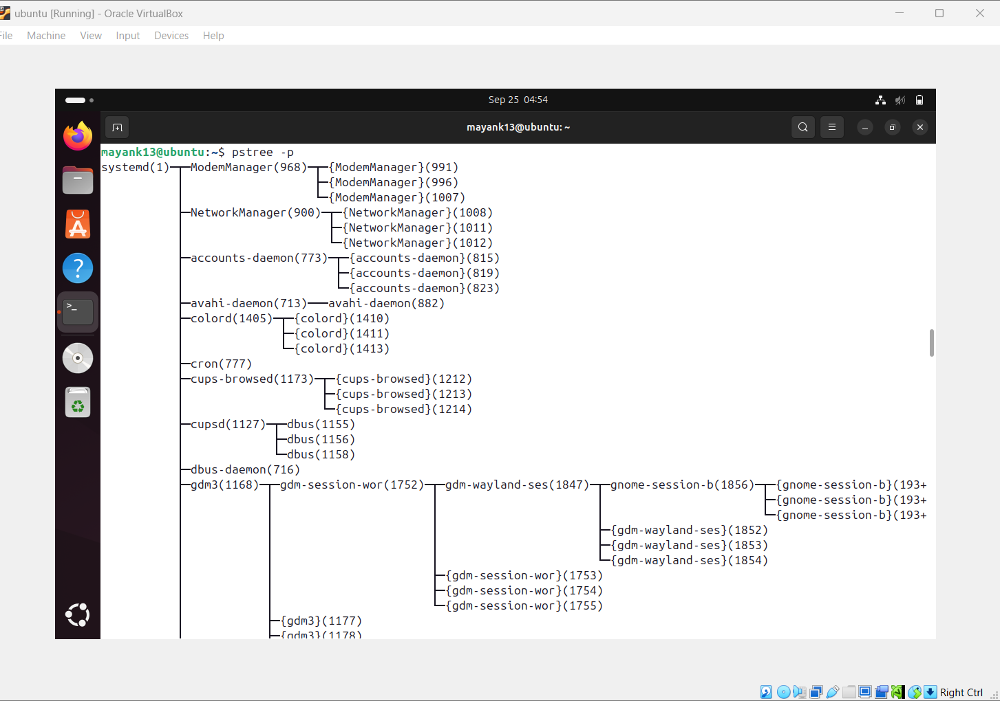

👉 Shows parent-child process relationships.

---

## 📊 3. Real-Time Monitoring

command - top

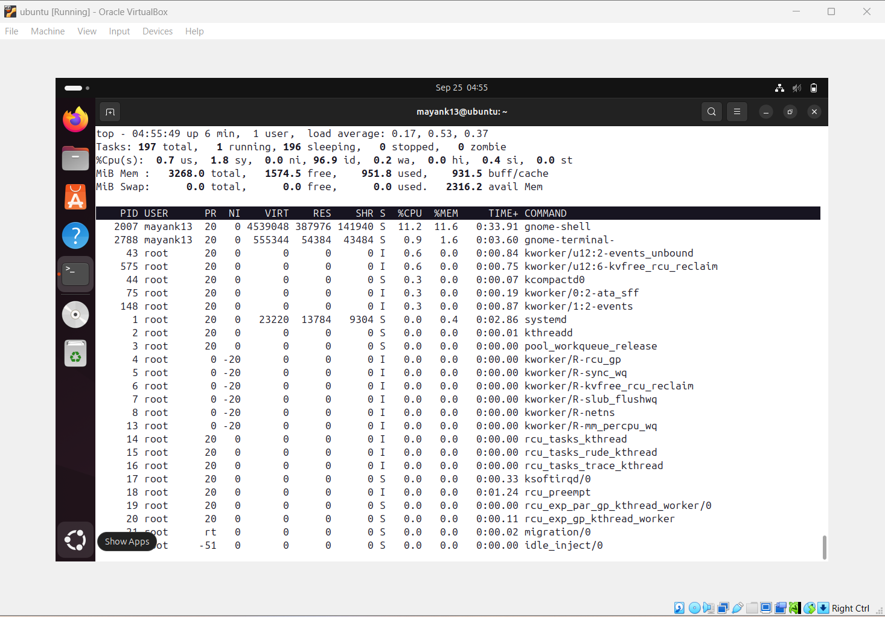

👉 Press q to quit.

---

## ⚡ 4. Adjust Process Priority

Start a process with low priority: nice -n 10 sleep 300 &

renice -n -5 -p 3050

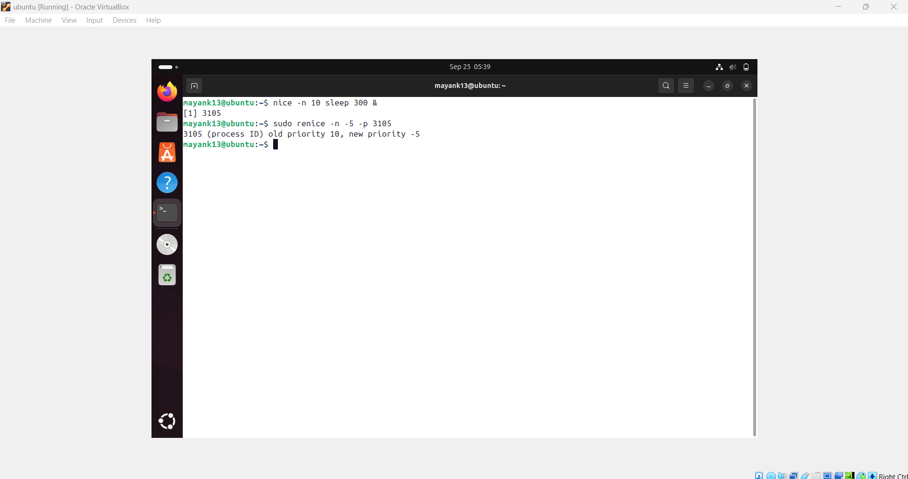

👉 Now process runs with higher priority.
---

## 🔧 5. CPU Affinity (Bind Process to CPU Core)

command - taskset -cp 3050

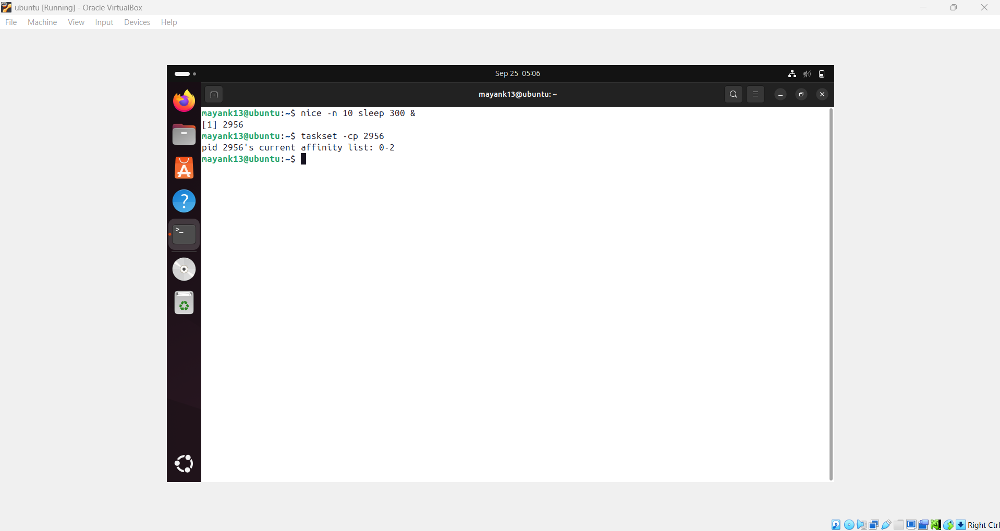

---

## 📂 6. I/O Scheduling Priority

command - ionice -c 3 -p 3050

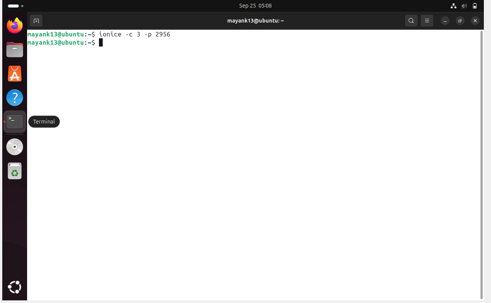

👉 Class 3 (idle) → Process only gets I/O when system is idle.

---

## 📑 7. File Descriptors Used by a Process

Command:
lsof -p 3050 | head -5

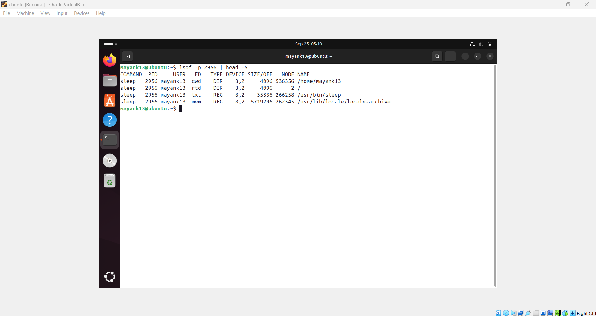
---

## 🐛 8. Trace System Calls of a Process

Command:
strace -p 3050

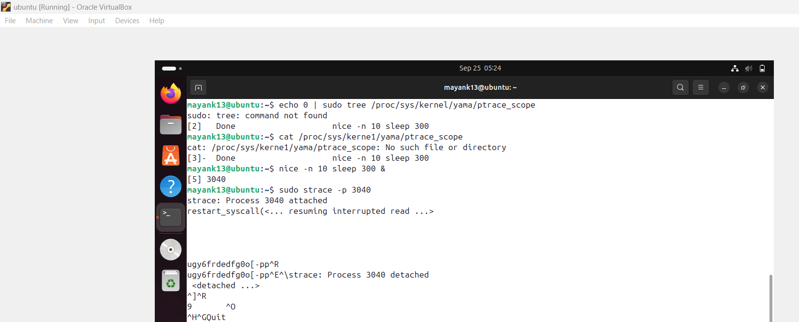

👉 Great for debugging.

---

## 📡 9. Find Process Using a Port

Command:
sudo fuser -n tcp 8080

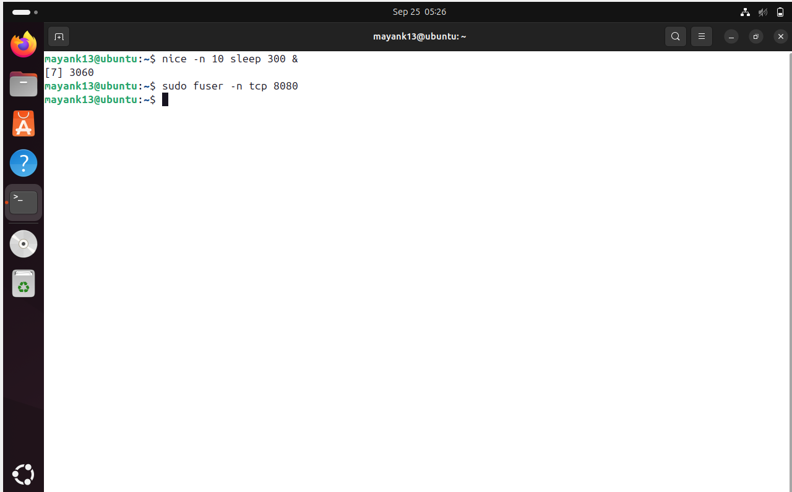

👉 PID 4321 is using port 8080.

---

## 📊 10. Per-Process Statistics

Command:
pidstat -p 3050 2 3

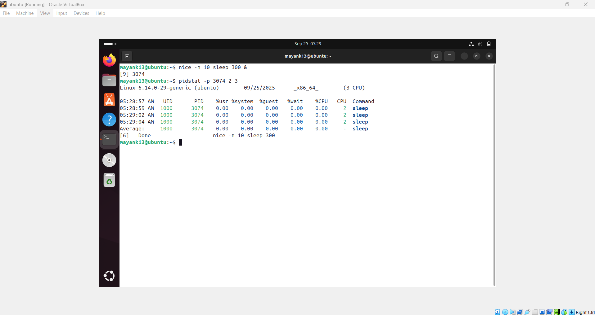

👉 Shows CPU usage every 2 seconds, 3 times.

---

## 🔐 11. Control Groups (cgroups) for Resource Limits

Create a new cgroup:

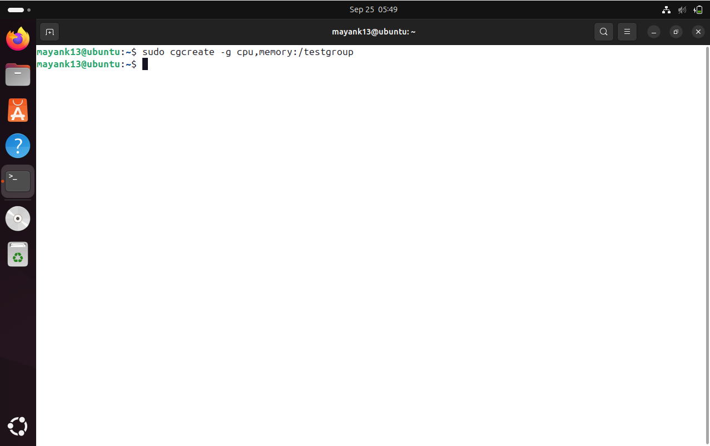

---

