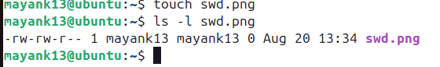
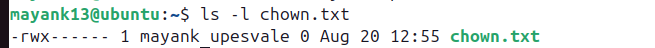

Practice Experiment
---

### 🔹 1. Create a new user

```bash
sudo useradd -m newuser

newuser - mayank
```

* `-m` → creates a home directory `/home/newuser`.


---

### 🔹 2. Create a new group

```bash
sudo groupadd newgroup

newgroup - mayank
```

---

### 🔹 3. Add the user to the group

```bash
sudo usermod -aG newgroup newuser

sudo usermod -aG upesvala mayank
```

* `-aG` → append user to the supplementary group (doesn’t remove existing groups).

--- 

### 🔹 4. Create a file (as current user, e.g. root or your login user)

```bash
touch swd.png
```

Check ownership:

```bash
ls -l swd.png


```

---

### 🔹 5. Assign ownership of the file to `newuser` and `newgroup`

```bash
sudo chown newuser:newgroup testfile.txt

sudo chown mayank:upesvale chown.txt
```

---

### 🔹 6. Verify ownership

```bash
ls -l chown.txt

output:
```

---