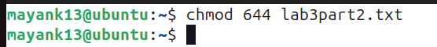
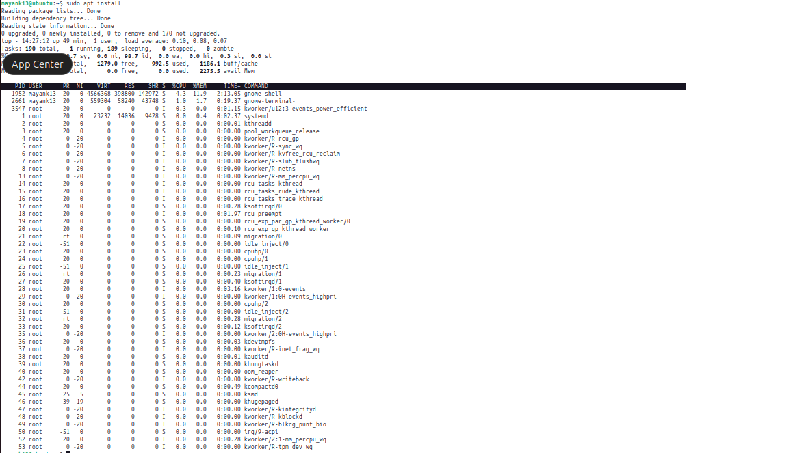

Great! Let’s now explore **intermediate and advanced terminal commands**, including **user management**, **permissions**, and **`sudo`** commands. These are especially useful for Linux/macOS system administration or development environments.

---

## ✅ 1. **`sudo` – Run Commands as Administrator**

`sudo` (SuperUser DO) allows you to run commands with root privileges.

```bash
sudo command
```

Example:

```bash
sudo apt update      # Run package update as admin
sudo reboot          # Reboot system
```


You'll usually be prompted to enter your password.

---

## ✅ 2. **User Management (Linux/macOS only)**

### 👤 `adduser` – Create a New User

```bash
sudo adduser newusername
username = mayank12
```

You’ll be prompted to set a password and user info.

### 🔑 `passwd` – Change User Password

```bash
sudo passwd newusername
passwd = swastik@12
```

---

### 👥 `usermod` – Modify User Account

Add a user to a group:

```bash
sudo usermod -aG groupname username
```

Example:

```bash
sudo usermod -aG sudo alice     # Give 'alice' sudo access
```

---

### ❌ `deluser` – Delete a User

```bash
sudo deluser username
```

To remove the user's home directory:

```bash
sudo deluser --remove-home username
```

---

## ✅ 3. **File Permissions with `chmod` and `chown`**

### 🔐 `chmod` – Change File Permissions

Basic syntax:

```bash
chmod [permissions] file
```

#### Common Usage:

```bash
chmod 755 script.sh     # Owner: read/write/execute; others: read/execute
chmod +x file.sh        # Add execute permission
chmod -x file.sh        # Remove execute permission
```
### 🔢 What Do Numbers Mean?

| Number | Permission             |
| ------ | ---------------------- |
| 7      | read + write + execute |
| 6      | read + write           |
| 5      | read + execute         |
| 4      | read only              |
| 0      | no permission          |

Example:

```bash
chmod 644 file.txt
# Owner: read/write, Group: read, Others: read
```

---

### 👑 `chown` – Change File Owner

```bash
sudo chown user:group file
```

Example:

```bash
sudo chown alice:alice myfile.txt
file = lab3part2.txt
```

---

## ✅ 4. **Disk Usage & System Info**

### 💽 `df` – Disk Space Usage

```bash

df -h
```


Shows mounted partitions with human-readable sizes.

---
### 📁 `du` – Directory Size

```bash
du -sh folder_name
folder_name = labfinal

```

---

### 🖥️ `top` – Live System Processes

```bash
top
```

Press `q` to quit.

Alternative: `htop` (better UI, needs to be installed)



---

---

## ✅ 5. **Networking Commands**

### 🌐 `ping` – Check Network Connectivity

```bash
ping google.com
```

Press `CTRL + C` to stop.


---

### 📶 `ifconfig` or `ip a` – Show IP Address & Network Info

```bash
ip a
```

```bash
ifconfig   # May require sudo or installation
```

---

### 🔍 `netstat` – Show Active Network Connections

```bash
netstat -tuln
```

Or use:

```bash
ss -tuln   # Faster alternative
```


---

## ✅ 6. **Package Management**

### For **Ubuntu/Debian (APT)**:

```bash
sudo apt update            # Refresh package list
sudo apt upgrade           # Upgrade installed packages
sudo apt install git       # Install a package
sudo apt remove git        # Uninstall a package
```

---

## ✅ 7. **Process Management**

### 🔎 `ps` – Show Running Processes

```bash
ps aux

```
 
---

### 🔫 `kill` – Kill a Process

```bash
kill <PID>
```

Example:
```bash
kill 23456
```

Force kill:

```bash
kill -8 23456
```

---

## ✅ 8. **Shutdown and Reboot**

```bash
sudo shutdown now        # Immediate shutdown
sudo shutdown -r now     # Immediate reboot
```