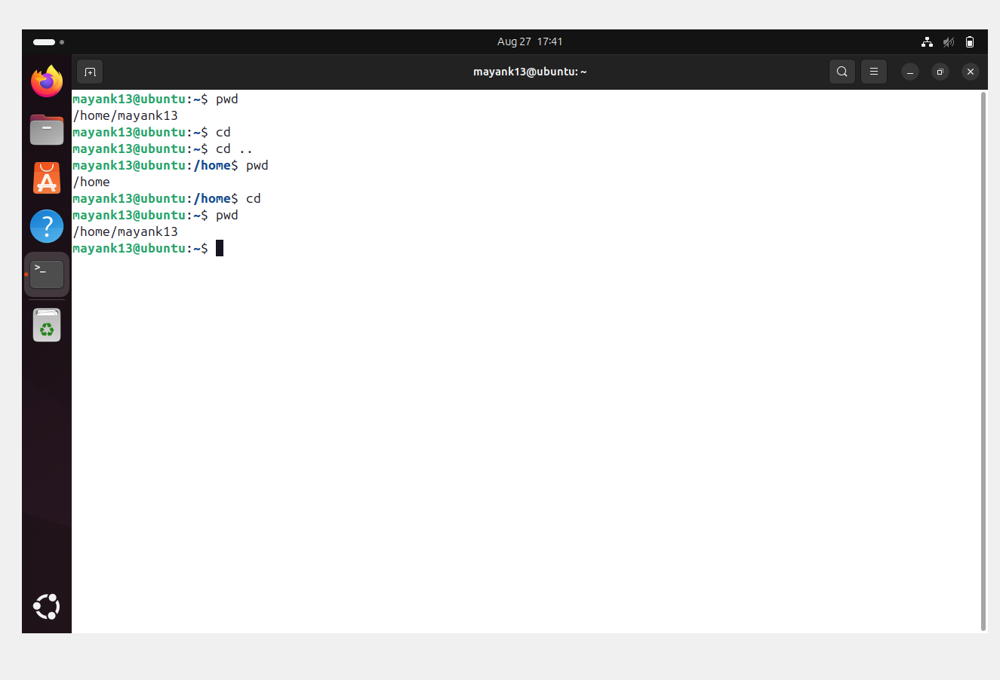
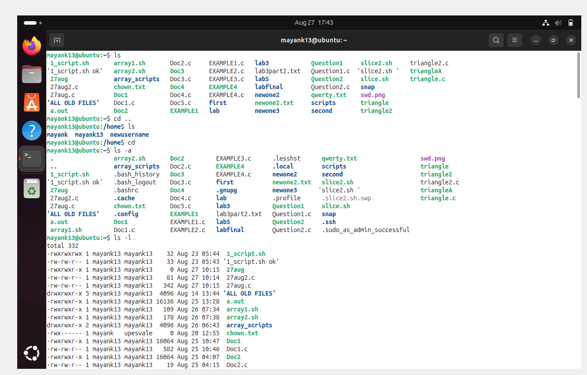
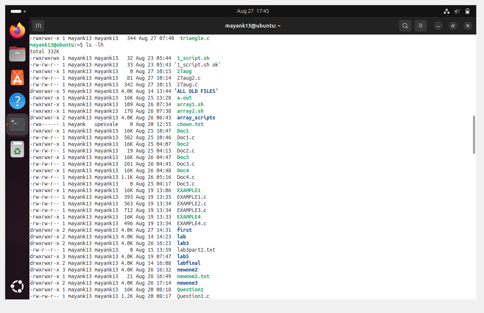
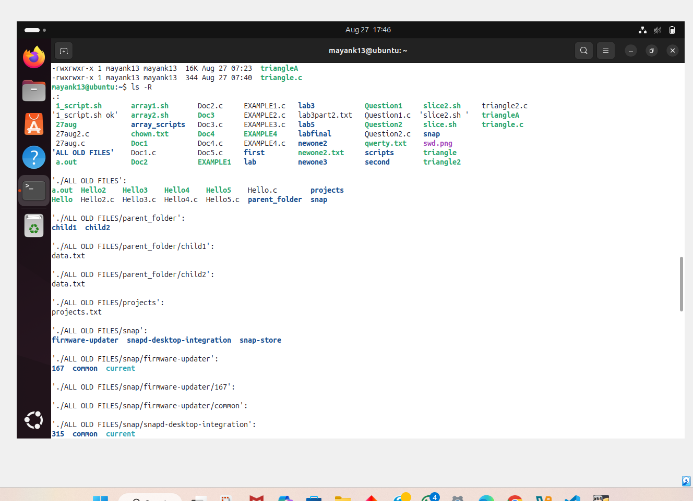

# 🐧✨ Basic linux commands 🚀

Welcome to your **Linux Cheatsheet**!  
This will help you **navigate**, **explore**, and **master** the basics of Linux like a true 🧑‍💻 hacker.  

## 📂 1. Print Working Directory – `pwd`

```bash
>> pwd
```

### 🖥️ Example Output:
```bash
/home/mayank13

```
💡 Pro Tip: Always use `pwd` when you get lost in too many folders 🗂️.

🖼️ 
---

## 📜 2. List Files & Folders – `ls`  

```bash
>> ls -a
```
### ✅ Common Flags:
- `ls -a` → Show **all files**, even hidden ones 🫥 (`.git`, `.bashrc` etc).
- `ls -l` → Show files in **long format** 📜 (permissions, owner, size).
- `ls -lh` → Show **human-readable sizes** 📏 (KB, MB, GB).
- `ls -R` → Show files inside folders **recursively** 🔄.

```bash
>> ls -a
```
🖼️ 

🖼️ 

🖼️ 

---