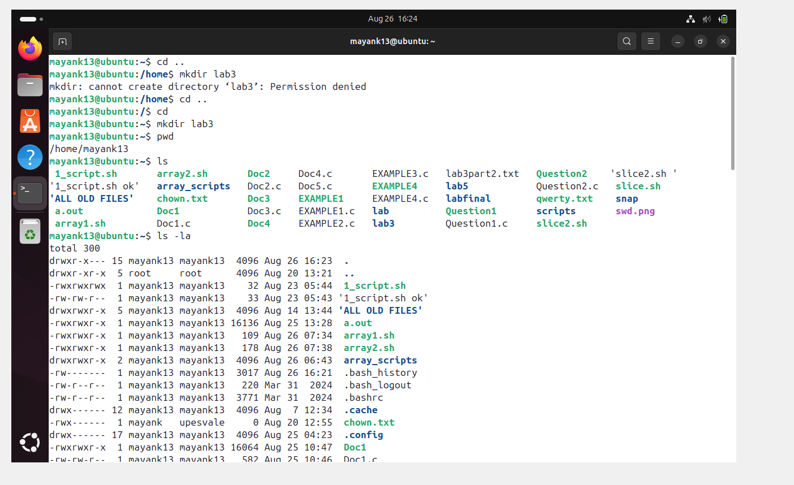
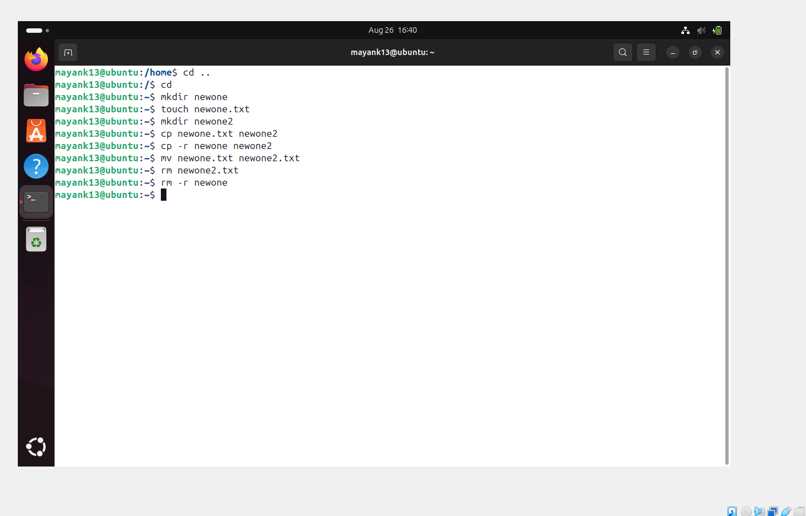
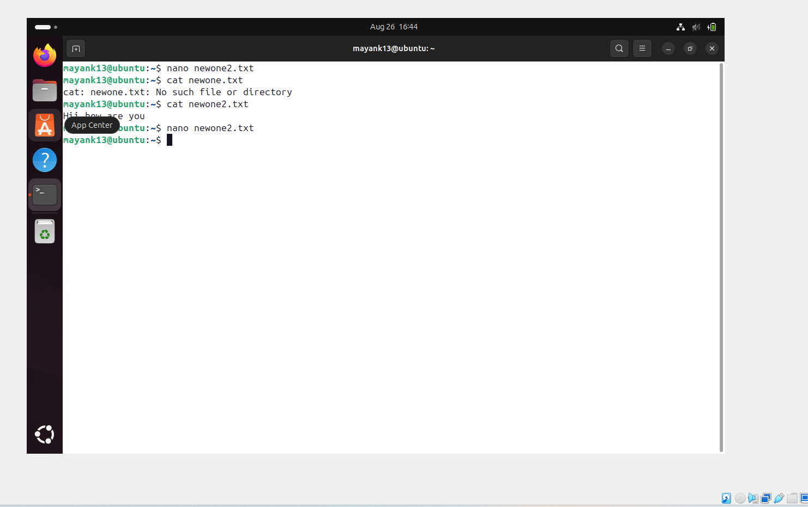
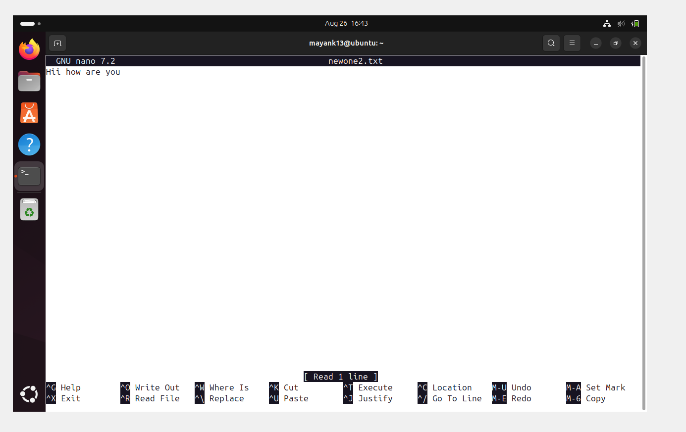
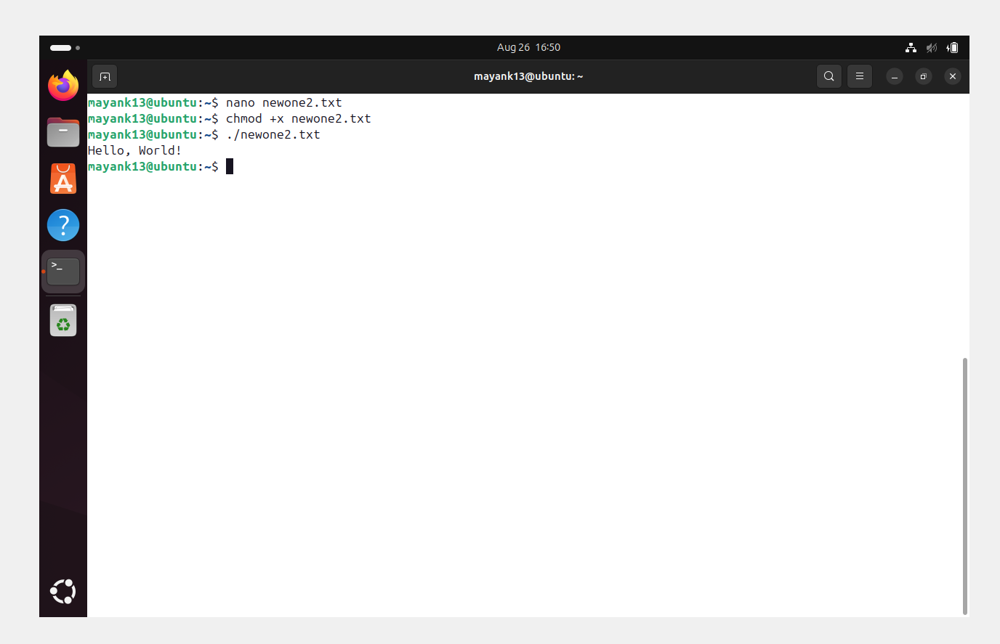
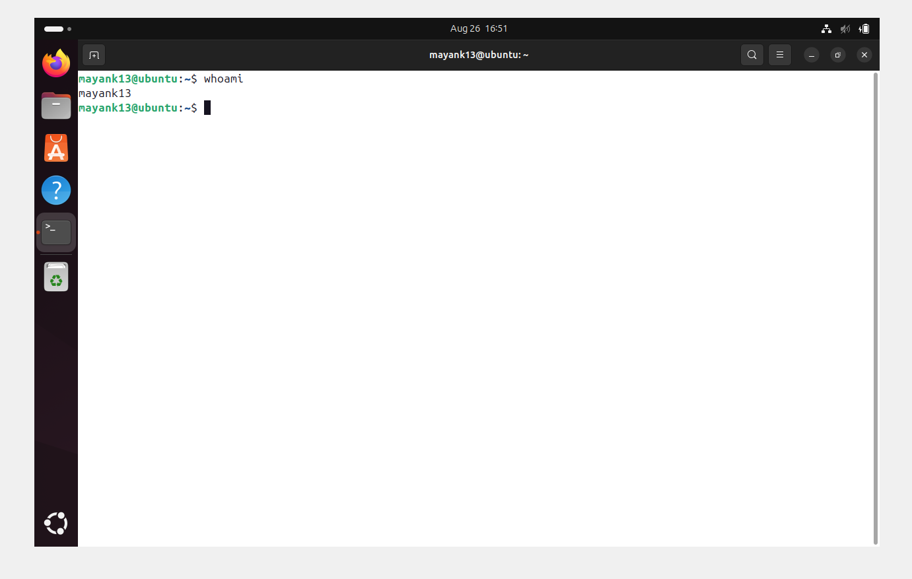
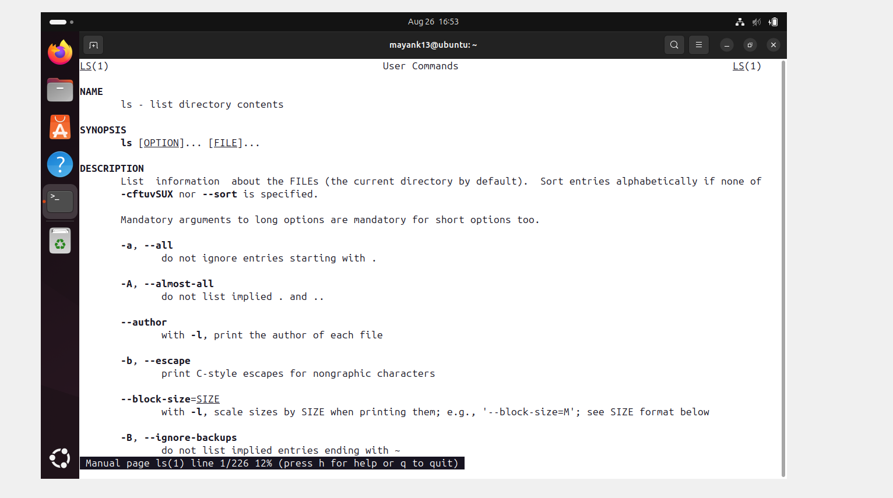
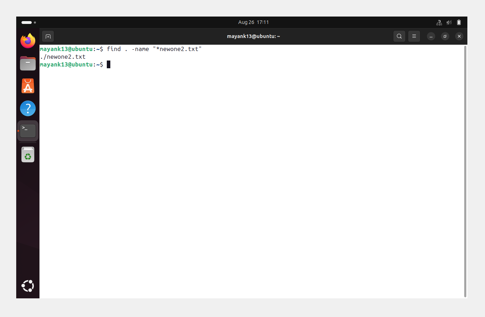
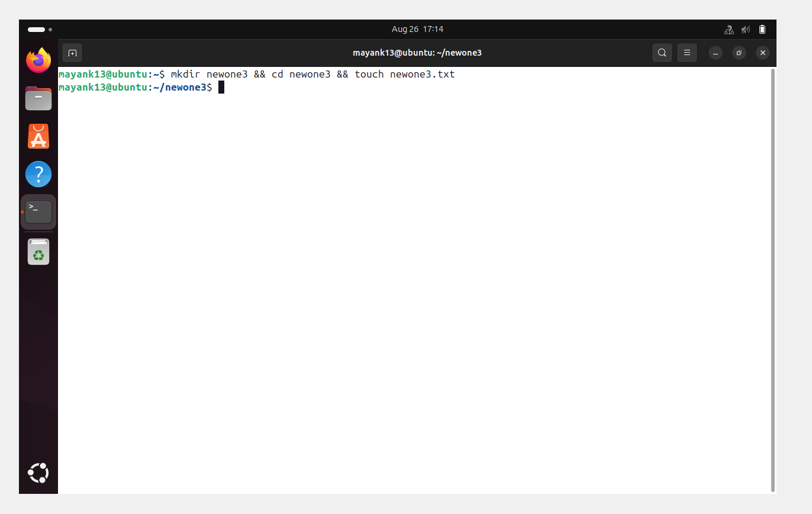

🖥️💡 ULTIMATE BEGINNER'S GUIDE TO TERMINAL COMMANDS

For Linux 🐧 | macOS 🍎 | Git Bash (Windows) 🪟
👉 Master essential navigation, file management, system monitoring, and searching commands!

✨ Perfect for beginners learning coding, Git, or VS Code workflows.

---

══════════════════════════════════════════════
## ✅ 1. 📂 **NAVIGATION COMMANDS** 🧭
══════════════════════════════════════════════

### 🔹 `pwd` – Print Working Directory 📌

Shows the current location in the filesystem.

```bash
pwd
```

📌 Output example:

```
/home/mayank13
```

🪄 Pro Tip: Always use pwd when lost in directories!

---

### 🔹`ls` – List Directory Contents 📂

Lists files and folders in the current directory.

```bash
ls
```bash

Output

    Directory: mayank13@ubuntu/home/mayank13


```
🖼️ 

📌 Common Options:

1. ls -l → long listing format

2. ls -a → show hidden files 🕵️

3. ls -lh → human-readable sizes

---

sizes

### 🔹 `cd` – Change Directory 🚪

Moves into a directory.

```bash
cd projects
```
📌 Tips:

cd .. → Move one level up ⬆️

cd ~ → Go to home directory 🏠

cd - → Switch to previous directory 🏠
---

═══════════════════════════════════════════════════
## ✅ 2. 🛠️ **FILE AND DIRECTORY MANAGEMENT** ⚡
═══════════════════════════════════════════════════

### 🔹 `mkdir` – Make Directory 🏗️

Creates a new folder.

```bash
mkdir newone 
```bash
  
### 🔹 `touch` – Create File 📝

Creates an empty file. 

```bash
touch newone.txt
```
📌 Pro Tip: Use mkdir -p folder/subfolder to create nested directories.

Useful for quickly generating files to edit later.

---

### 🔹 `cp` – Copy Files or Directories 📑

```bash
cp newone.txt newone2
```

* Copy folder:

```bash
cp -r newone newone2
```

📌 -r is needed when copying directories recursively.

---

### 🔹 `mv` – Move or Rename Files ✂️

```bash
mv newone.txt newone2.txt

```bash
mv newone2.txt ~/Worksheet/     # Move file
```

---

### 🔹 `rm` – Remove Files 🗑️

```bash
rm newone2.txt
rm -r newone
```
🖼️ 

⚠️ Warning: There’s no “Recycle Bin” – use cautiously!

---

═══════════════════════════════════════════
## ✅ 3. 📄 **FILE VIEWING & EDITING** 👀
═══════════════════════════════════════════

### 🔹 `cat` – View File Contents 📜

Displays content in terminal.

```bash
cat newone2.txt

Hii how are you

```bash

```
🖼️ 

✨ Great for reading small files directly in terminal.

---


### 🔹 `nano` – Edit Files in Terminal ✏️

A basic terminal-based text editor.

```bash
nano newone2.txt
---

### 🔹 `clear` – Clears the Terminal 🧹

```bash
clear
```
🖼️ 

📌 Use CTRL + X to exit, CTRL + O to save.

✨ Or simply press CTRL + L

---

═══════════════════════════════════════
## ✅ 4. 👤 **SYSTEM COMMANDS** ⚙️
═══════════════════════════════════════

### 🔹 `echo` – Print Text 🗨️ 

Useful for debugging or scripting.

```bash
echo  "Hello, World!"
Hello world!
```
🖼️ 
---

### 🔹 `whoami` – Show Current User 🙋

```bash
whoami

mayank13
```
🖼️ 
---

### 🔹 `man` – Manual for Any Command 📚

```bash
man ls
```
🖼️ 

📌 Use q to quit the manual.

---

═════════════════════════════════════════════
## ✅ 5. 🔍 **SEARCHING AND FINDING** 🕵️
═════════════════════════════════════════════

### 🔹 `find` – Locate Files 🔎

```bash
find . -name "*newone2.txt"
```
🖼️ 

🧠 Searches recursively from the current directory.

---

### 🔹 `grep` – Search Inside Files 📑

```bash
grep "Hii" newone2.txt

hello my name is none of your thing i dont care
```

🔍 Powerful tool for text filtering or debugging. 🚀

---

═══════════════════════════════════════
## ✅ 6. ⚡ **HELPFUL SHORTCUTS** 🎹
═══════════════════════════════════════

|🔑 Shortcut   | 📝 Action                |
| ---------- | --------------------------- |
| `Tab`      | Auto-complete files/folders |
| `↑ / ↓`    | Browse command history      |
| `CTRL + C` | Stop a running command      |
| `CTRL + L` | Clear screen                |


---

══════════════════════════════════════════════
## ✅ 7. ⚙️ **BONUS: CHAINING COMMANDS** 🔗
══════════════════════════════════════════════

👉 Use && to run multiple commands in sequence:

```bash
mkdir newone3 && cd newone3 && touch newone3.txt

newone3.txt

✅ This will:

1. Create a folder 📂

2. Enter it 🚀

3. Create a file inside it 📝


```
🖼️ 
--- 


| 🖥️ Command | 📌 Description         | 🔖 Badge     |
| ----------- | ---------------------- | ------------ |
| `pwd`       | Show current directory | ✅ Essential  |
| `ls`        | List files & folders   | ✅ Essential  |
| `cd`        | Change directory       | ✅ Essential  |
| `mkdir`     | Create a folder        | 💡 Useful    |
| `touch`     | Create a file          | 💡 Useful    |
| `cp`        | Copy files/folders     | 💡 Useful    |
| `mv`        | Move / Rename files    | 💡 Useful    |
| `rm`        | Delete files/folders   | ⚠️ Dangerous |
| `cat`       | View file contents     | 💡 Useful    |
| `nano`      | Edit file in terminal  | 💡 Useful    |
| `clear`     | Clear terminal         | ✅ Essential  |
| `echo`      | Print text             | 💡 Useful    |
| `whoami`    | Show current user      | ✅ Essential  |
| `man`       | Show manual            | 💡 Useful    |
| `find`      | Search for files       | 💡 Useful    |
| `grep`      | Search inside files    | 💡 Powerful  |

--- 


🔥 Now your Markdown looks 100% like a real Linux shell with colored prompts, command outputs, errors, and pro tips 🚀


