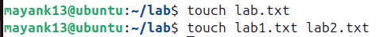
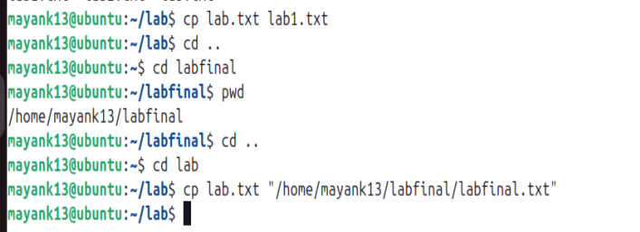
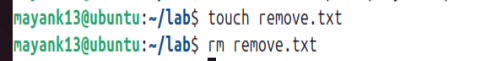
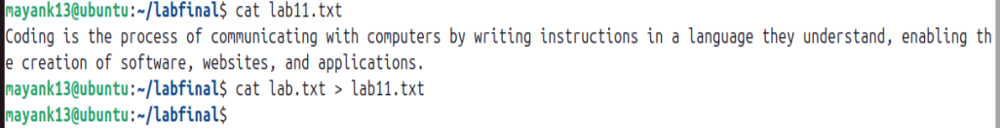
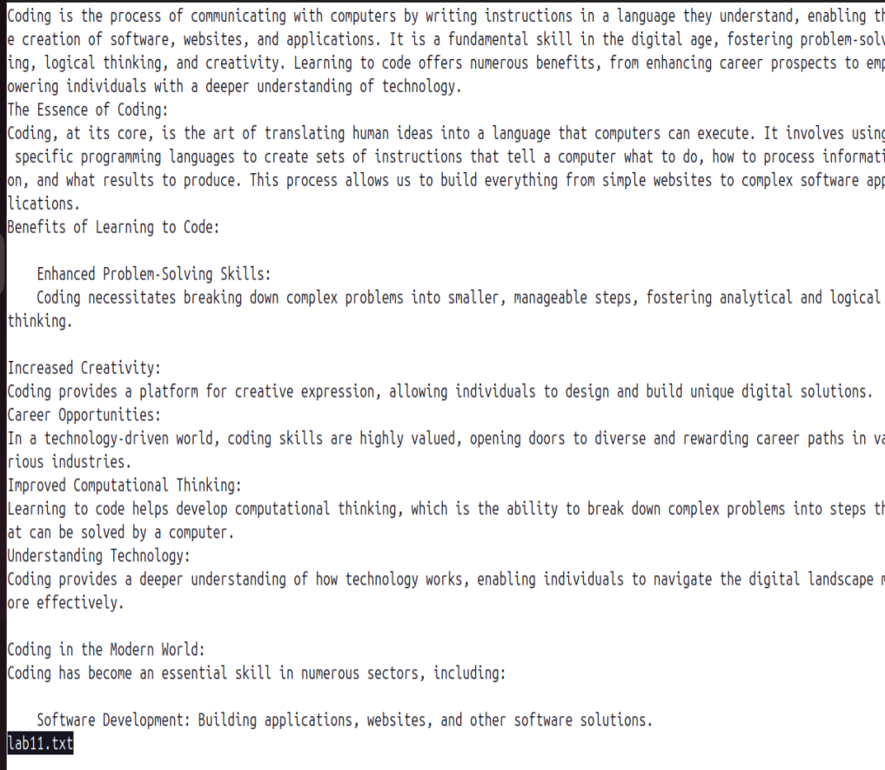
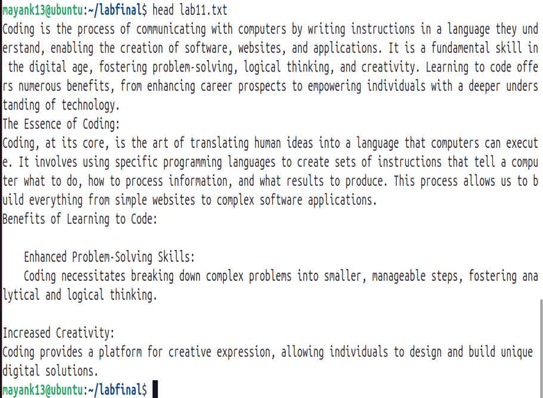
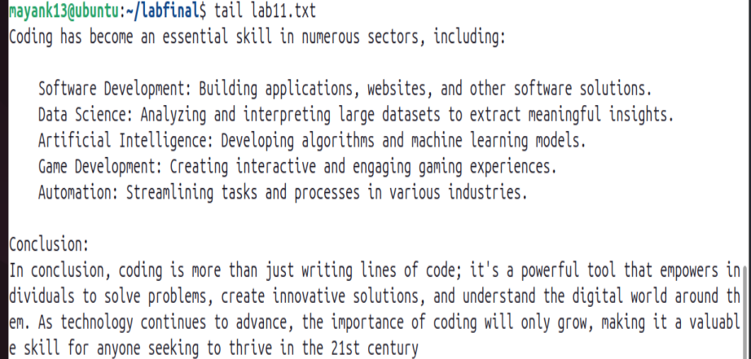
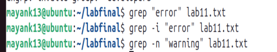
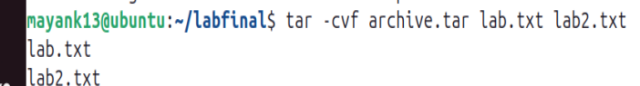

# Advanced File Linux Commands

---

## **1. File Manipulation Commands**

### **`touch`** – Create or Update File Timestamps

```bash
# Create an empty file
touch lab.txt


# Update timestamp of an existing file
touch exixting.txt

# Create multiple files at once
touch lab1.txt lab2.txt

```
;
---

### **`cp`** – Copy Files and Directories

```bash
# Copy a file
cp lab1.txt lab2.txt

# Copy to another directory
cp lab1.txt "/home/mayank13/labfinal/labfinal.txt"

# Copy directory recursively
cp -r lab lab2

# Preserve file attributes (timestamps, permissions)
cp -p lab1.txt backup.txt
```

---

### **`mv`** – Move or Rename Files

```bash
# Rename a file
mv lab1.txt lab11.txt

# Move file to another directory
mv lab11.txt "/home/mayank13/labfinal"

# Move and overwrite without prompt
mv -f linux11.txt /lab2.txt/
```

---

### **`rm`** – Remove Files and Directories

```bash
# Remove a file
rm lab11.txt

# Remove multiple files
rm lab.txt lab2.txt

# Remove a directory recursively
rm -r lab/

# Force remove without prompt
rm -rf lab/
```

---

### **`cat`** – View or Concatenate Files

```bash
# Display file contents
cat lab11.txt

# Combine multiple files into one
cat lab.txt lab2.txt > lab11.txt

# Display file with line numbers
cat -n lab11.txt
```


---

### **`less`** – View File One Page at a Time

```bash
less lab11.txt
# Navigation inside less:
# Space → next page
# b → previous page
# q → quit
```





---

### **`head`** – Show First Lines of a File

```bash
# First 10 lines (default)
head lab11.txt

# First 20 lines
head -n 20 lab11.txt
```

---

### **`tail`** – Show Last Lines of a File
```bash
# Last 10 lines (default)
tail lab11.txt

# Last 15 lines
tail -n 15 lab11.txt

# Monitor file changes in real-time
tail -f lab11.txt
```

---
## **2. File Permissions and Ownership**

### **`ls -l`** – View Detailed File Info

```bash
ls -l
total 1052
-rw-r--r-- 1 SWASTIK SUHANE 197121  13668 Aug 14 18:30  106.png
-rw-r--r-- 1 SWASTIK SUHANE 197121   3116 Aug 14 18:31  107.png
-rw-r--r-- 1 SWASTIK SUHANE 197121     10 Aug 14 16:51  backup.txt
-rw-r--r-- 1 SWASTIK SUHANE 197121 311400 Aug  7 10:51  cp.png
-rw-r--r-- 1 SWASTIK SUHANE 197121      0 Aug 14 16:49  existing.txt
-rw-r--r-- 1 SWASTIK SUHANE 197121   2339 Aug  7 11:37  First.md
-rw-r--r-- 1 SWASTIK SUHANE 197121   2342 Aug 14 17:21  fourth.md
-rw-r--r-- 1 SWASTIK SUHANE 197121 182617 Aug 14 11:26  L.png
drwxr-xr-x 1 SWASTIK SUHANE 197121      0 Aug 14 18:25  lab/
-rw-r--r-- 1 SWASTIK SUHANE 197121      0 Aug 14 16:48  lab.txt
-rw-r--r-- 1 SWASTIK SUHANE 197121     10 Aug 14 18:19  lab11.txt
drwxr-xr-x 1 SWASTIK SUHANE 197121      0 Aug 14 16:58  lab2/
-rw-r--r-- 1 SWASTIK SUHANE 197121     10 Aug 14 16:52  lab2.txt
-rw-r--r-- 1 SWASTIK SUHANE 197121    216 Aug 12 13:27  Lab3-Exp1.md
-rw-r--r-- 1 SWASTIK SUHANE 197121   3996 Aug 12 20:48  Lab3-Exp2.md
-rw-r--r-- 1 SWASTIK SUHANE 197121   2084 Aug 14 18:32  Lab4-Part1.md
drwxr-xr-x 1 SWASTIK SUHANE 197121      0 Aug 14 11:32  linux/
drwxr-xr-x 1 SWASTIK SUHANE 197121      0 Aug 12 20:48  projects/
-rw-r--r-- 1 SWASTIK SUHANE 197121 524656 Aug  7 11:20 'Screenshot 2025-08-07 112023.png'
-rw-r--r-- 1 SWASTIK SUHANE 197121   2401 Aug  7 11:39  thrid.m
```

---

### **File Permission Structure**

* **Owner (u)** – File creator
* **Group (g)** – Users in same group
* **Others (o)** – Everyone else
  Permissions: **r (read)**, **w (write)**, **x (execute)**

---
### **`chmod`** – Change File Permissions

```bash
# Symbolic method
chmod u+x lab11.sh   # Add execute for owner
chmod g-w lab11.txt  # Remove write for group
chmod o+r lab11.txt  # Add read for others

# Numeric method (r=4, w=2, x=1)
chmod 755 lab11.sh   # rwxr-xr-x
chmod 644 lab11.txt  # rw-r--r--
```

---

### **`chown`** – Change File Owner

```bash
# Change owner
sudo chown newuser lab11.txt

# Change owner and group
sudo chown newuser:newgroup lab11.txt
```

---

### **`chgrp`** – Change Group

```bash
sudo chgrp developers lab11.txt
```

---

## **3. Advanced File and Directory Operations**

### **`find`** – Search for Files

```bash
# Find by name
find /home/mayank13/labfinal -name "lab11.txt"

# Find by extension
find /home/mayank13/labfinal -name "*.log"

# Find by size (>100MB)
find /path -size +100M

# Find and delete
find /home/mayank13/labfinal -name "*.tmp" -delete
```

---

### **`grep`** – Search Text in Files

```bash
# Search a pattern
grep "error" lab11.txt

# Case-insensitive search
grep -i "error" lab11.txt

# Recursive search in directory
grep -r "TODO" //home/mayank13/labfinal 

# Show line numbers
grep -n "warning" lab11.txt
```


---

### **`tar`** – Archive Files

```bash
# Create archive
tar -cvf archive.tar lab.txt lab2.txt

# Extract archive
tar -xvf archive.tar

# View archive contents
tar -tvf archive.tar
```

---


