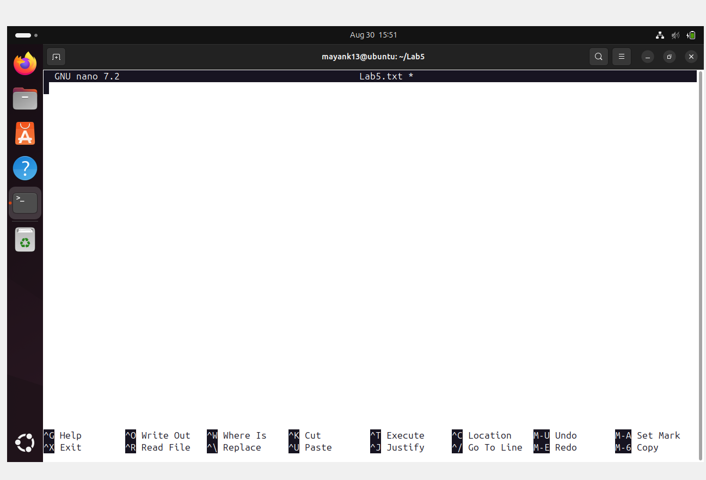
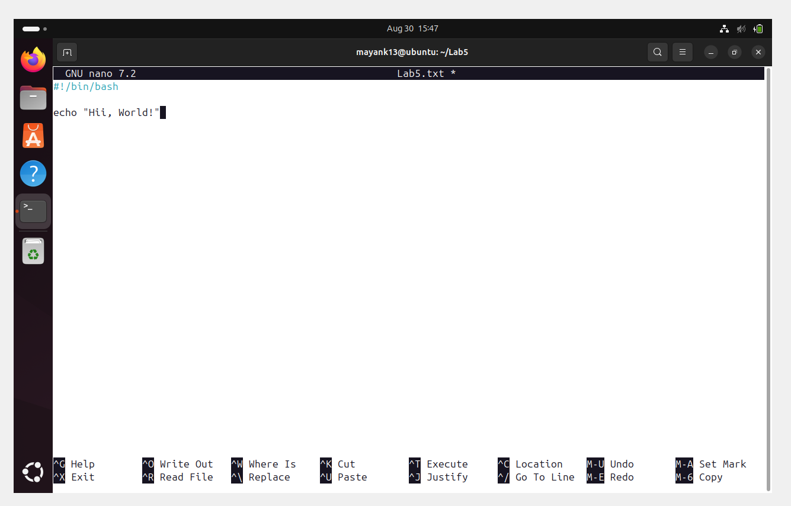
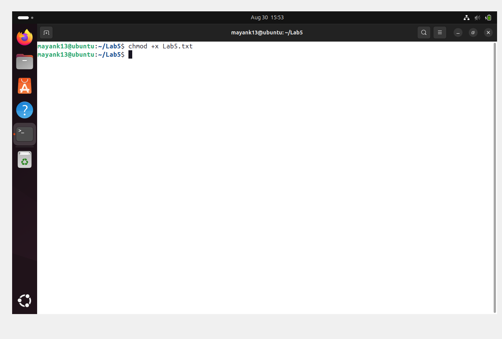
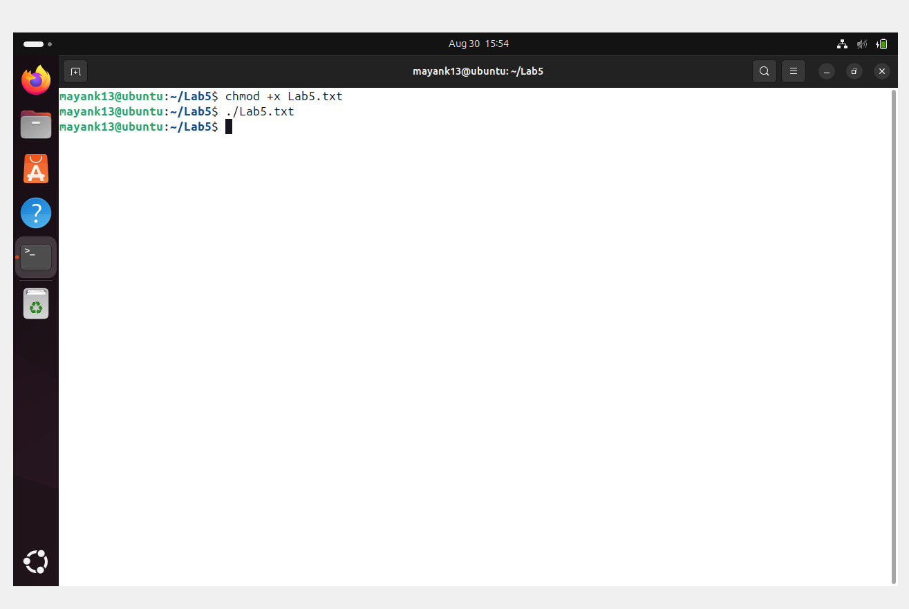
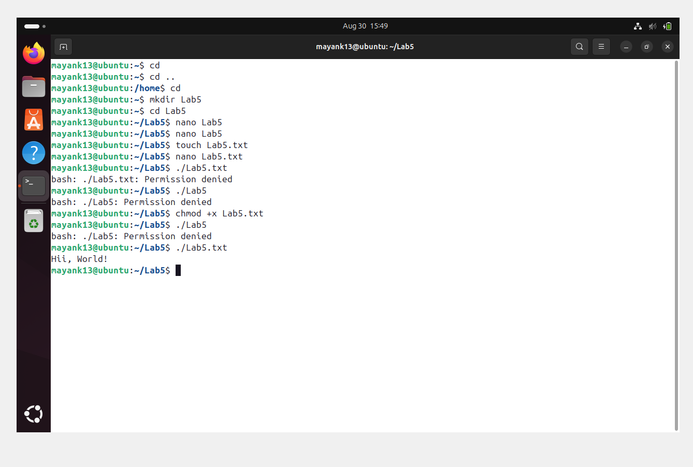
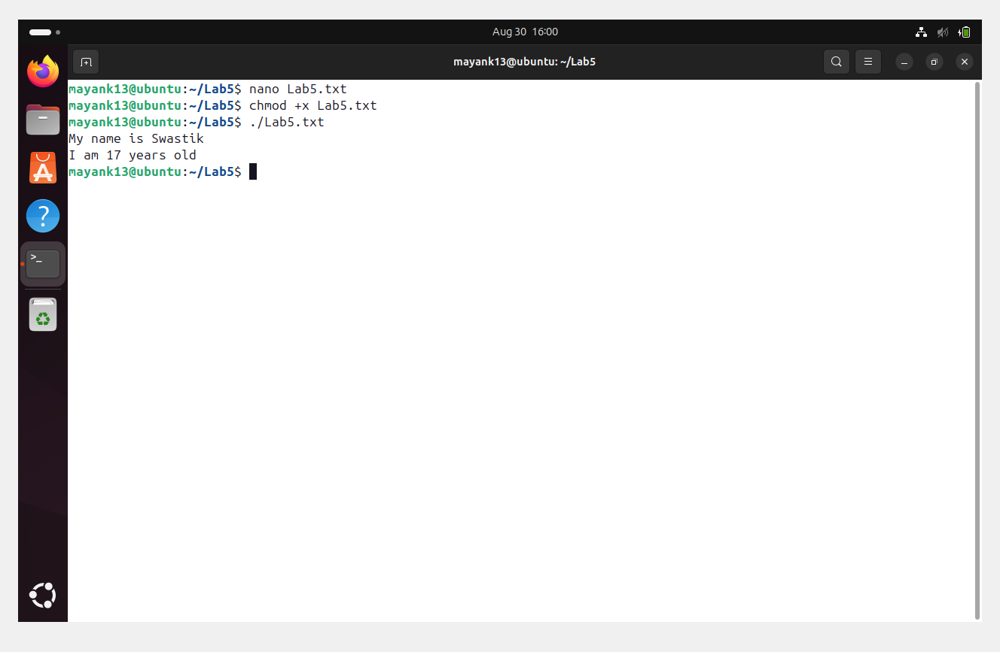
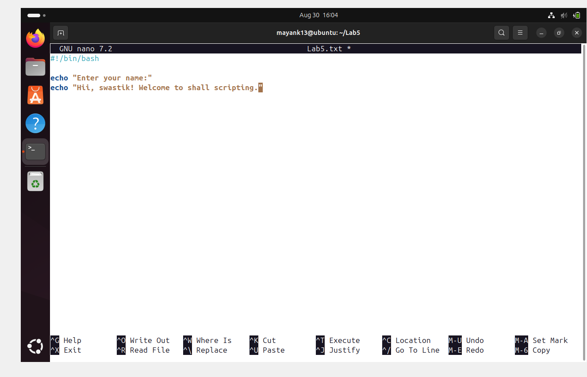
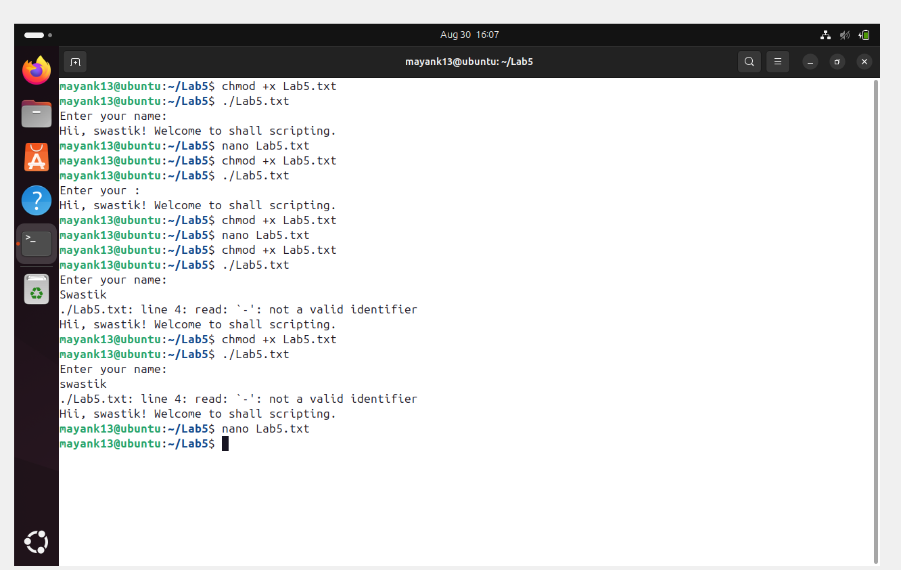
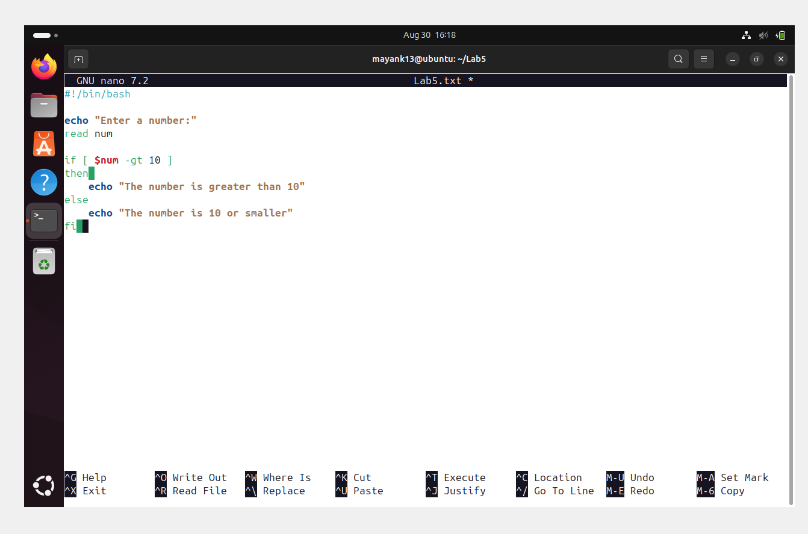
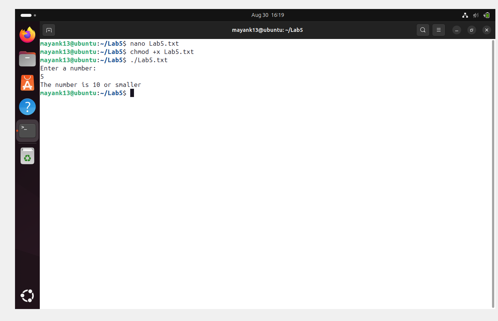

🐚✨ Shell Scripting Made Easy

Learn the basics of shell scripting with fun stickers 🎭, clear examples 📖, and handy pro tips 💡.

══════════════════════════════════
#  📖 What is a shell script?
══════════════════════════════════
* A **shell script** is a 📝 text file containing a series of commands written for the shell to execute.
* It automates tasks that you would normally run in the terminal.

✨ Examples:
🔹 Running multiple commands at once
🔹 Looping through files
🔹 Making backups

⚡ Pro Tip: Think of shell scripts as your personal assistant 🤖 doing the boring stuff for you!
---

═════════════════════════════════════════
## 🚀 1. Creating Your First shell script ═════════════════════════════════════════

1️⃣ Open a terminal and create a file:

   ```bash
     nano Lab5.txt
   ```
📷 
   ---

2️⃣ Add the following content:

   ```bash
   #!/bin/bash
   # This is a simple shell script

   echo "Hii, World!"
   ```
   

📷 

   ---

3️⃣ Save and exit (`CTRL+O`, `CTRL+X` in nano).

4️⃣ Make it executable:

   ```bash
   chmod +x Lab5.txt
   ```


   --- 

5. Run it:

   ```bash
   ./Lab5.txt
   ```

   --- 

✅ Output should be:

```
Hii, World!
```

---

## 2. Variables in Shell

You can store data in variables:

```bash
#!/bin/bash

name="Swastik"
age=17

echo "My name is $name"
echo "I am $age years old"

echo "My name is Swastik"
echo "I am 17 years old"
```

⚠️ Note: **No spaces** around `=` when assigning values.




---

## 3. Taking User Input

```bash
#!/bin/bash

echo "Enter your name:"
read username - swastik

echo "Hii, swastik! Welcome to shell scripting."
```

* `read` → takes input from the user.
* `$username` → retrieves the value.




---

## 4. Conditional Statements (if-else)

```bash
#!/bin/bash

echo "Enter a number:"
read num

if [ $num -gt 10 ]
then
    echo "The number is greater than 10"
else
    echo "The number is 10 or smaller"
fi
```

* `-gt` → greater than.
* Other operators: `-lt` (less than), `-eq` (equal).





---

