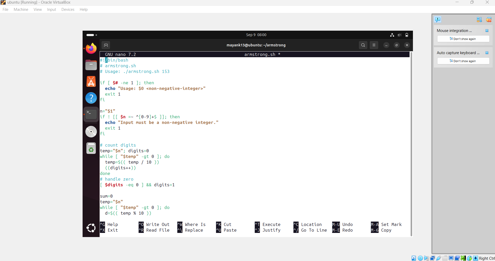
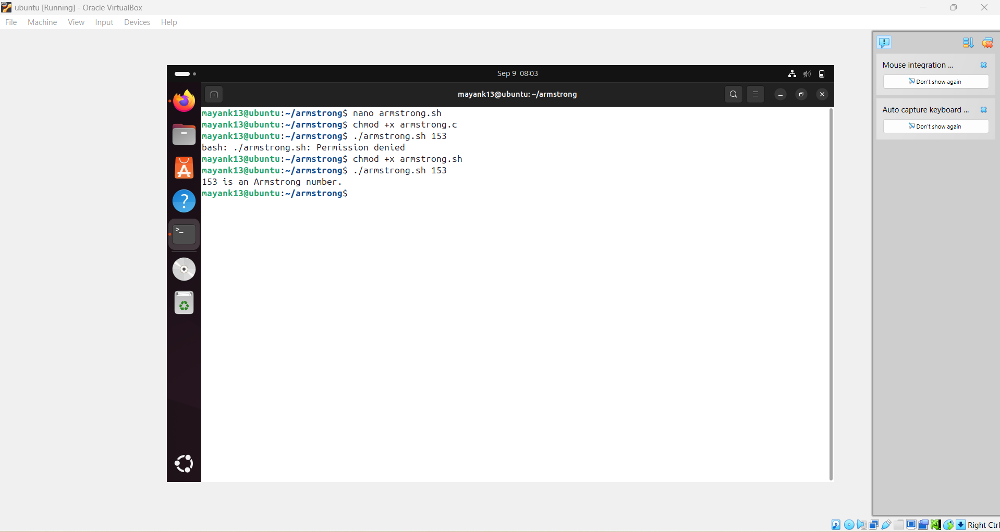

# 🔢 Experiment – Armstrong Number  

## 🎯 Objective  
To check whether a given number is an **Armstrong Number**.  

---

## 📘 Mathematical Context  

👉 An **Armstrong number** (also called a **narcissistic number**) of `n` digits is a number that is equal to the **sum of its digits raised to the power n**.  

### Formula:  
\[
\text{Armstrong Number: }  
\text{num} = \sum_{i=1}^{n} (d_i^n)  
\]  

Where:  
- \( d_i \) = each digit of the number  
- \( n \) = total number of digits  

### Example:  
- For **153** (3 digits):  
\[
153 = 1^3 + 5^3 + 3^3 = 1 + 125 + 27 = 153
\]  
✅ Hence, 153 is an **Armstrong Number**.  

- For **9474** (4 digits):  
\[
9474 = 9^4 + 4^4 + 7^4 + 4^4 = 9474
\]  
✅ Hence, 9474 is an **Armstrong Number**.  

---

## 🖥️ Script

``` bash

#!/bin/bash

// armstrong.sh
// Usage: ./armstrong.sh 153

if [ $# -ne 1 ]; then
echo "Usage: $0 <non-negative-integer>"
exit 1
fi

n="$1"
if ! [[ $n =~ ^[0-9]+$ ]]; then
echo "Input must be a non-negative integer."
exit 1
fi

// count digits
temp="$n"; digits=0
while [ "$temp" -gt 0 ]; do
temp=$(( temp / 10 ))
((digits++))
done

// handle zero
[ $digits -eq 0 ] && digits=1

sum=0
temp="$n"
while [ "$temp" -gt 0 ]; do
d=$(( temp % 10 ))
// compute d^digits
pow=1
for ((i=0;i<digits;i++)); do pow=$(( pow * d )); done
sum=$(( sum + pow ))
temp=$(( temp / 10 ))
done

if [ "$sum" -eq "$n" ]; then
echo "$n is an Armstrong number."
else
echo "$n is NOT an Armstrong number (sum=$sum)."
fi

--- 

```

## 📊 Example Run

Enter an integer: 153
153 is an Armstrong number.

Enter an integer: 125
125 is NOT an Armstrong number.

---







## ✅ Conclusion

```bash

Armstrong numbers satisfy the property:

Number
=
∑
(
digits
𝑛
)
Number=∑(digits
n
)

The program successfully verifies Armstrong numbers for any number of digits.


---
