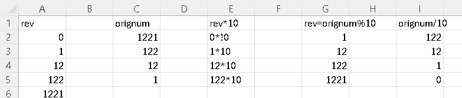
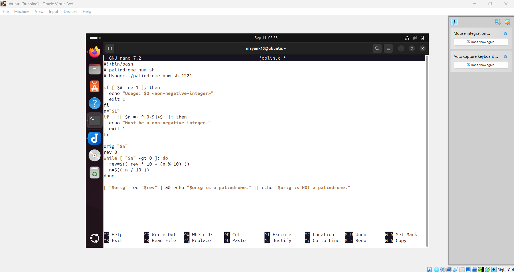
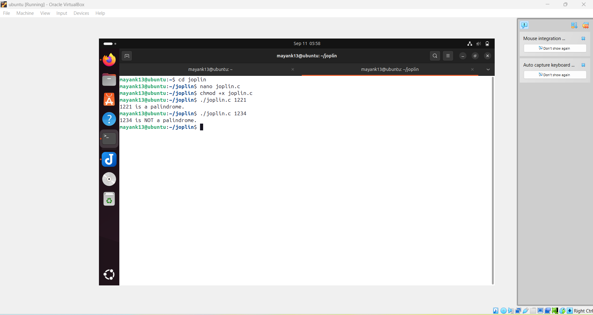

🔢 Palindrome Number Script
📌 Objective

A palindrome number is a number that remains the same when its digits are reversed.
Examples:

✅ 121 → Palindrome

✅ 1331 → Palindrome

❌ 123 → Not a Palindrome

This script checks whether a given number is a palindrome or not.

⚙️ Script: palindrome.sh
#!/bin/bash

# 🔢 Palindrome Number Checker

read -p "Enter a number: " num
original=$num
rev=0

while [ $num -gt 0 ]
do
    digit=$(( num % 10 ))
    rev=$(( rev * 10 + digit ))
    num=$(( num / 10 ))
done

if [ $original -eq $rev ]
then
    echo "✅ $original is a Palindrome number."
else
    echo "❌ $original is NOT a Palindrome number."
fi

▶️ Example Run
$ bash palindrome.sh
Enter a number: 1221
✅ 1221 is a Palindrome number.

$ bash palindrome.sh
Enter a number: 1234
❌ 1234 is NOT a Palindrome number.

📖 Explanation

Take input from the user.

Reverse the number using modulus (%) and division (/).

Compare reversed number with the original.

Print result ✅ or ❌.

