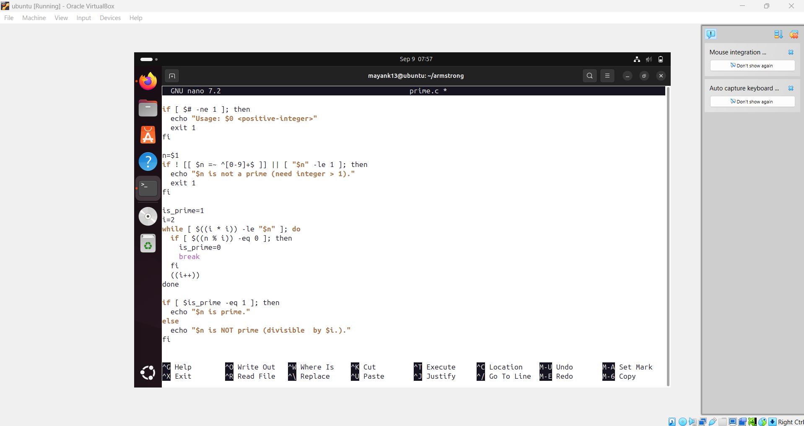
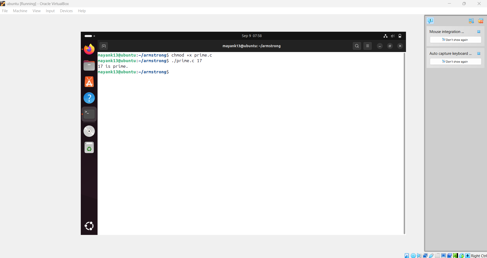

# 🔢 Experiment – Prime Number  

## 🎯 Objective  
To check whether a given number is a **Prime Number**.  

---

## 📘 Mathematical Context  

👉 A **prime number** is a natural number greater than **1** that has **only two factors**:  
1. **1**  
2. **Itself**  

### Formula / Definition:  

A number 
𝑛
∈
𝑁
n∈N is called prime if:

𝑛
>
1
and
∀
  
𝑑
∈
𝑁
,
  
(
𝑑
∣
𝑛
  
⇒
  
𝑑
=
1
  
or
  
𝑑
=
𝑛
)
n>1and∀d∈N,(d∣n⇒d=1ord=n)

Where:

𝑑
∣
𝑛
d∣n means "d divides n".

If 
𝑛
n has no divisors other than 1 and itself, it is prime.

### Examples:  
- **7** → Factors: {1, 7} → ✅ Prime  
- **10** → Factors: {1, 2, 5, 10} → ❌ Not Prime  

---

## 🖥️ Script 

``` bash

#!/bin/bash
// prime_check.sh
// Usage: ./prime_check.sh 17

if [ $# -ne 1 ]; then
echo "Usage: $0 <positive-integer>"
exit 1
fi

n=$1
if ! [[ $n =~ ^[0-9]+$ ]] || [ "$n" -le 1 ]; then
echo "$n is not a prime (need integer > 1)."
exit 1
fi

is_prime=1
i=2
while [ $((i * i)) -le "$n" ]; do
if [ $((n % i)) -eq 0 ]; then
is_prime=0
break
fi
((i++))
done

if [ $is_prime -eq 1 ]; then
echo "$n is prime."
else
echo "$n is NOT prime (divisible by $i)."
fi


```






---

## 📊 Example Run

```bash

Enter an integer: 7
7 is a Prime number.

Enter an integer: 12
12 is NOT a Prime number.

```

---

## ✅ Conclusion

A prime number has exactly two factors: 1 and itself.

The program checks divisibility up to √n, making it efficient.

---