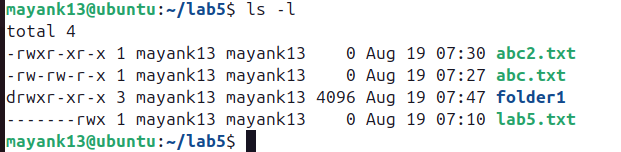
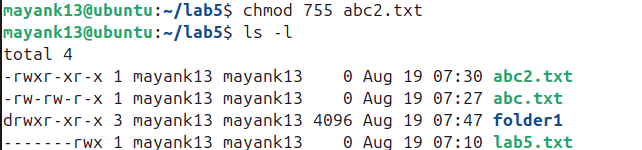
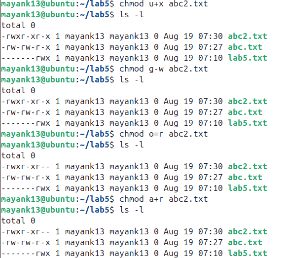
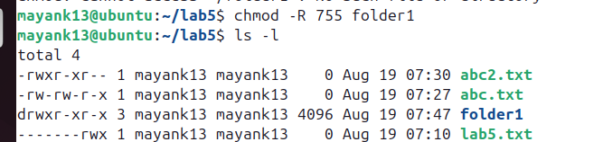
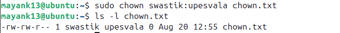
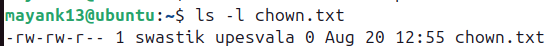

# 🐚 Shell Tutorial – File Permissions with `chmod` and `chown`

---

## 🔹 1. Understanding File Permissions in Linux

Each file/directory in Linux has:

* **Owner** → The user who created the file.
* **Group** → A group of users who may share access.
* **Others** → Everyone else.

### Permission Types

* **r** → Read (4 in numeric)
* **w** → Write (2 in numeric)
* **x** → Execute (1 in numeric)

### Permission Layout

Example from `ls -l`:

-rwxr-xr--

```
-rwxr-xr--
```

Breakdown:

* `-` → Regular file (`d` = directory, `l` = symlink, etc.)
* `rwx` → Owner has read, write, execute
* `r-x` → Group has read, execute
* `r--` → Others have read only



---

## 🔹 2. `chmod` – Change File Permissions

### Syntax

```bash
chmod [options] mode filename
```

Modes can be set in **numeric (octal)** or **symbolic** form.

---

### (A) Numeric (Octal) Method

Each permission is represented as a number:

* Read = 4
* Write = 2
* Execute = 1

Add them up:

* `7 = rwx`
* `6 = rw-`
* `5 = r-x`
* `4 = r--`
* `0 = ---`

#### Example:

```bash
chmod 755 abc2.txt
```

Meaning:

* Owner: 7 → `rwx`
* Group: 5 → `r-x`
* Others: 5 → `r-x`



---

### (B) Symbolic Method

Use `u` (user/owner), `g` (group), `o` (others), `a` (all).
Operators:

* `+` → Add permission
* `-` → Remove permission
* `=` → Assign exact permission

#### Examples:

```bash
chmod u+x abc2.txt    # Add execute for owner
chmod g-w abc2.txt     # Remove write from group
chmod o=r abc2.txt      # Set others to read only
chmod a+r abc2.txt   # Everyone gets read access
```

---

### (C) Recursive Changes

```bash
chmod -R 755 /lab5
```

* `-R` → applies changes recursively to all files/subdirectories.


---

## 🔹 3. `chown` – Change File Ownership

### Syntax

```bash
chown [options] new_owner:new_group filename

new_owner - swastik
new_group - upesvala
filename - chown.txt
```

---


## 🔹 4. Putting It All Together

### Example Scenario

```bash

touch chown.txt
ls -l chown.txt
```

Output:

```

```

Now:

```bash
chmod 700 chown.txt    # Only owner has rwx
chmod u+x,g-w chown.txt   # Add execute for user, remove write for group
chown root:admin chown.txt # Change owner to root and group to admin
```


---

## 🔹 5. Quick Reference Table

| Numeric | Permission | Meaning      |
| ------- | ---------- | ------------ |
| 0       | ---        | No access    |
| 1       | --x        | Execute only |
| 2       | -w-        | Write only   |
| 3       | -wx        | Write + Exec |
| 4       | r--        | Read only    |
| 5       | r-x        | Read + Exec  |
| 6       | rw-        | Read + Write |
| 7       | rwx        | Full access  |

---

✅ **Key Tip**: Use **numeric for quick settings** (e.g., 755, 644) and **symbolic for fine adjustments** (`u+x`, `g-w`).

---
