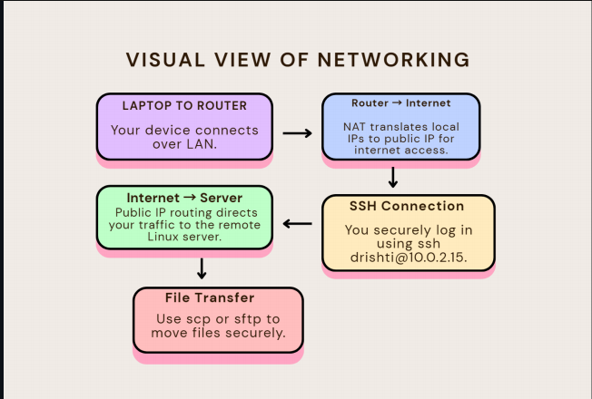
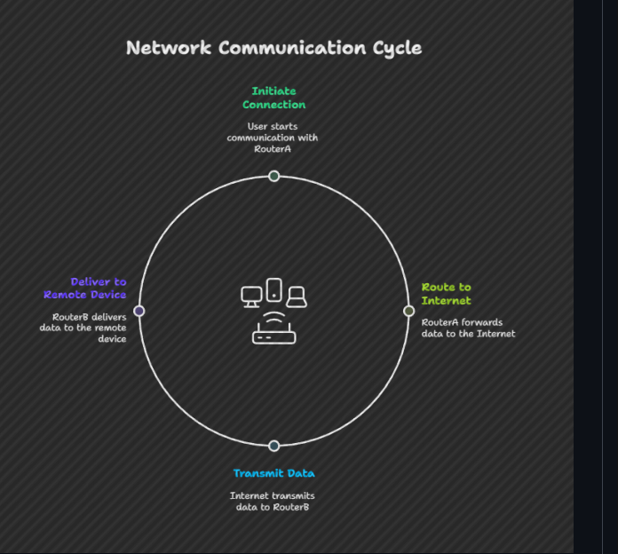
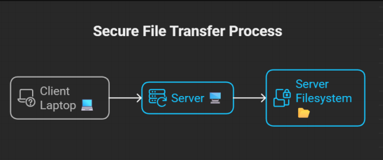
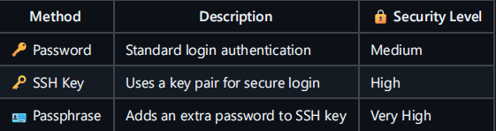
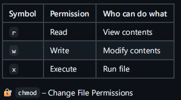
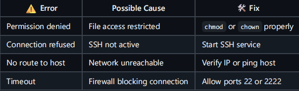
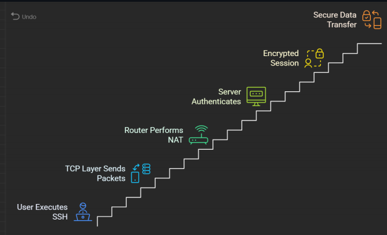
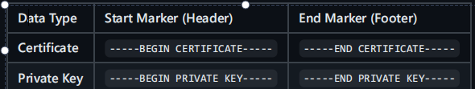
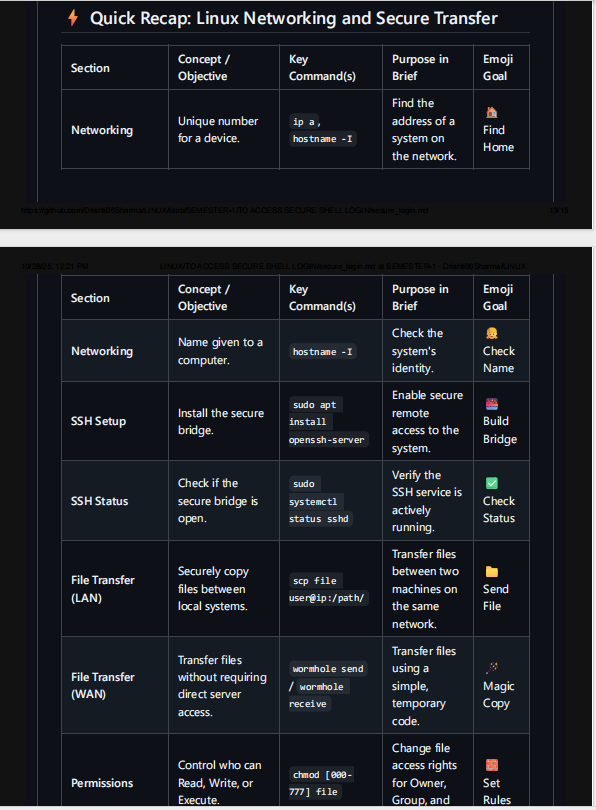

# 🧾 Technical Documentation: Secure File
 Transfer & SSH Networking in Linux 
 
## 🌟 1. Introduction 

Welcome! Here we will learn to secure file transfer and SSH networking in Linux! 🐧✨
This document is designed with beginners in mind — real examples, clear steps. For more
clarity I'll add screenshots too for your reference. 💡
💬 Think of SSH as your secure bridge to another Linux computer — you can talk to
it, send files, and even see its screen, all safely

---

## 🎯 2. Objective

The goal of this guide is to help you:

 🔹 🔗 Connect Linux systems within the same or different networks.

 🔹📁 Transfer files securely using SSH, SCP, and SFTP.

 🔹🧱 Understand how file permissions protect data.

 🔹🧠 Strengthen your Linux networking basics.

 🔹🏠 Learn about how to read ip address.

 🔹👧 How to check hostname.

 🔹🪄 Exploring different ways to tranfer files.(with download and without downloading)

---

## 🧠 3. Networking Fundamentals (Extended & Simplified)

Before we dive into commands, let’s understand what’s happening behind the scenes. 🌍

| Command         | Description             |
| --------------- | ----------------------- |
| `ip addr`       | Show IP address         |
| `ping`          | Test connectivity       |
| `ssh user@host` | Remote login            |
| `scp`           | Secure file copy        |
| `ftp`           | Connect to FTP server   |
| `adduser`       | Create new user         |
| `groupadd`      | Create new group        |
| `chmod`         | Change file permissions |
| `chown`         | Change ownership        |

🧭 Visual: Network Overview



🗣 In brief: Networking is how your computer “talks” to another system. SSH(SECURE
SHELL) is the language they use when they want to keep their conversation private and
secure. 

---

## 🧩 4. SSH Setup — Step-by-Step

### ✅ Pre-requisites

Linux machine with sudo access.
SSH server installed and enabled.
Network connectivity (LAN or WAN).

### ⚙️ Installation & Setup

sudo apt install openssh-server openssh-client -y
sudo systemctl enable sshd
sudo systemctl start sshd

#### 🧾 Check status:

sudo systemctl status sshd

#### 📍 POINT TO REMEMBER:

SUDO We use sudo whenever a command we are trying to run would result in a
"Permission Denied" error because it involves a system-wide change.

## 🖧 5. File Transfer Operations

### 💡 Case A: Different Networks (Internet / WAN)



#### 🔹 Command for File Transfer

```bash
sudo apt install sender (it will require you password to install)
reciever receive sender

```
---

```bash

sudo apt install reciever (it will require you password to install)
sender send ~/file.sh

```
---

🧩 Authenticate → Transfer → Done!

### 🌍 Case B: Same network



#### 🔸 Steps:

Based on the provided guide, here are the steps for sending a file between two Linux
systems on the same network using scp , broken down into a concise checklist.

## 🔐 6. Authentication & Security



## 🧱 7. File Permissions & Ownership



```bash
chmod 007 linux.txt # others full access
chmod 402 linux.txt # Owner read , Others write
chmod u+x linux.txt # Owner dan execute
chmod o=r linux.txt # Others read

```
---

## ⚙️ 8. Troubleshooting Tips



#### ✅ Test connection:

```bash
ping 10.0.2.15

```
---

## 🌐 9. Complete SSH Communication Flow-



## 🗝 10. Passkeys(PEM FILES)

The .PEM (Privacy-Enhanced Mail) file is a foundational standard for handling
cryptographic data. It's not the data itself, but a container that makes the data safe to
move around. Think of it as a labeled digital envelope for secure items! ✉

### 🔑 What is Inside a PEM File?

A single PEM file can store various sensitive components used in secure internet
communication (like HTTPS):
1. Certificates: The public identity used to verify a server. 🆔
2. Private Keys: The secret key used to decrypt data. Keep this safe! 🤫
3. Root/Intermediate CAs: Certificates that form the "chain of trust." 

### 🧐 How to Recognize a PEM File

PEM files are unique because they are plain text, not binary. They use Base64 encoding,
which looks like gibberish but allows the data to be easily copied and pasted.

Every PEM file starts and ends with clearly defined boundaries:



---

## ⚠️ Key Takeaway

A .pem file is simply a text-based container designed to securely and portably store
different types of encryption assets. It's the standard certificate format of the internet! ✅




---


