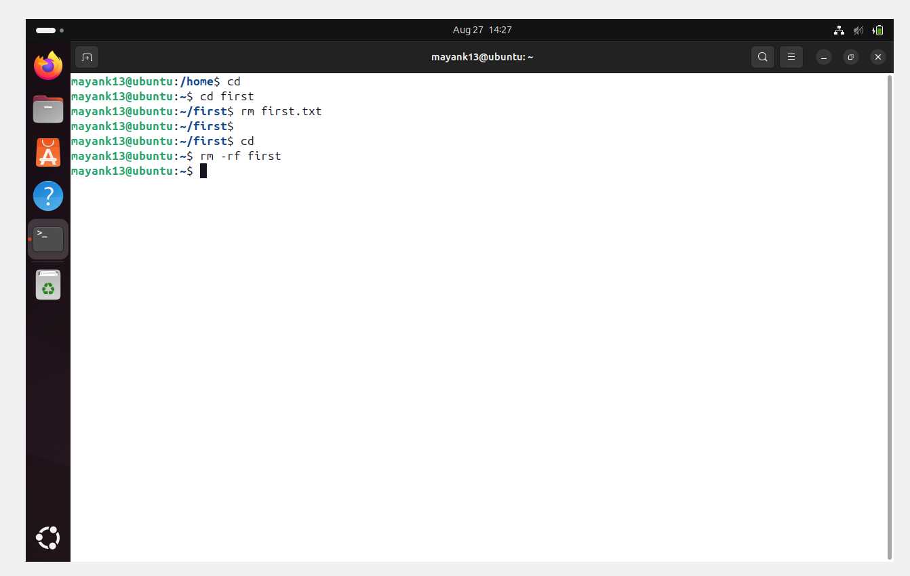
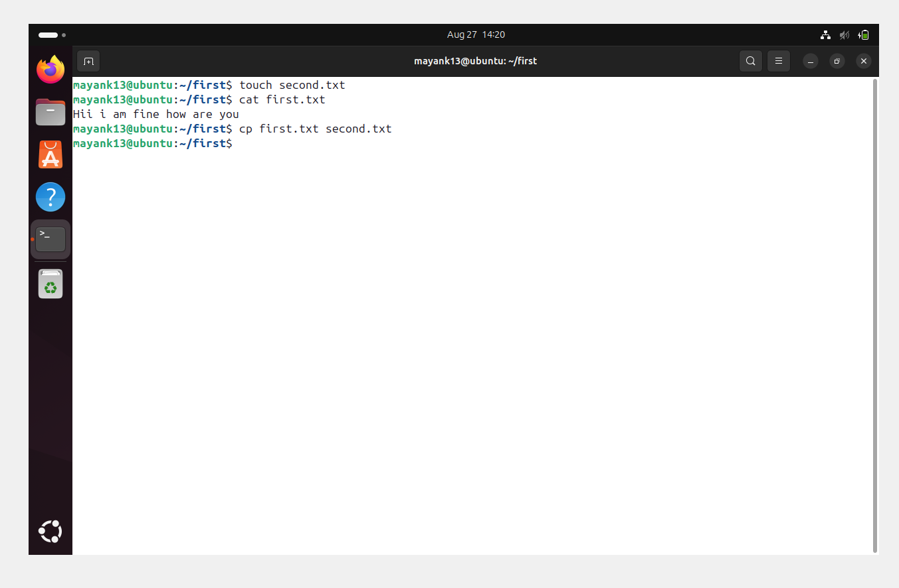
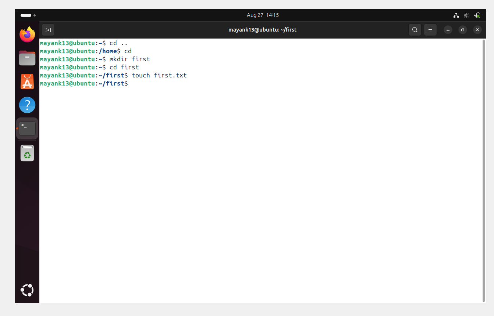
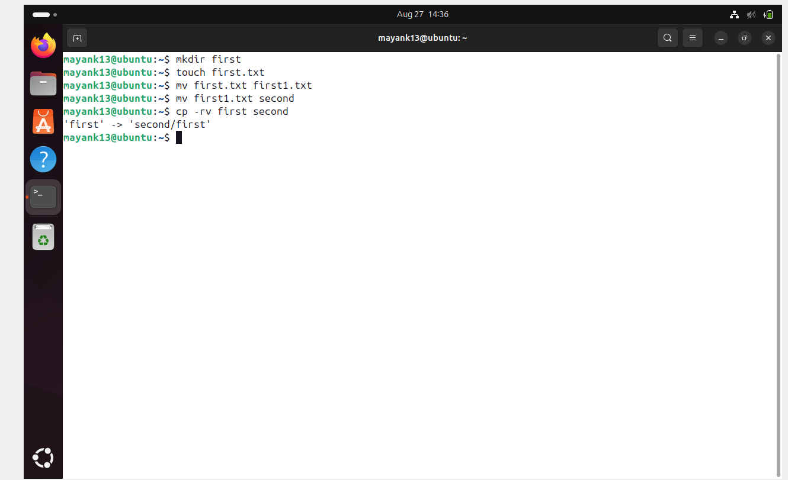

Here's a Markdown (`.md`) file that documents the basic usage of `rm`, `cp`, and `touch`, with a simple example for moving one file to another, and a note about `rm -rf`💻💚

---

### 📄 File : **file_commands.md**

````markdown
🌟🐧Linux File Commands: 
rm` ❌ | `cp` 📑 | `touch` 🆕 | `mv` 📦  

══════════════════════════════════════════════════
## 1️⃣  `rm` – ❌ Remove Files or Directories    
══════════════════════════════════════════════════

💡 **Think of it as a "delete" button 🗑️**

### 🔹 Syntax:
```bash
rm [options] file_name
````

### 🔹 Options (⚡ Stickers Help You Remember):
- 🔥 `-f` : **Force delete** (ignore errors, never ask).  
- 🌀 `-r` : Delete **recursively** (folders + contents).  
- 💣 `-rf` : **Dangerous combo!** Forcefully delete everything.  


### 🔹 Example:

```bash
rm first.txt        # 📝  Delete a file
rm -rf first        # 💣  Forcefully delete a folder and everything inside
```

⚠️ **Warning**: `rm -rf /` = 💀 **SYSTEM DESTROYER!** Be super careful.

🖼️ 
---

══════════════════════════════════════════════════
## 2️⃣ `cp` – Copy Files and Directories              
══════════════════════════════════════════════════

### 🔹 Syntax:

```bash
cp [options] source destination
```

### 🔹 Common Options:

- 📂 `-r` :  Copy directories **recursively**.  
- 📢 `-v` :  **Verbose mode** (shows each copy)

### 🔹 Example:

```bash
cp first.txt second.txt       # 📝 Copy a file
cp -rv first/second/          # 📂  Copy a folder recursively and verbosel
```
🖼️ 
---

══════════════════════════════════════════════════
## 3️⃣ `touch` – 🆕 Create Empty Files or Update Timestamps
══════════════════════════════════════════════════

💡 **Think of it as "create new file" ➕**  

### 🔹 Syntax:

```bash
touch file_name
```

### 🔹 Example:

```bash
touch first.txt     # 📄 Creates a new empty file named first.txt
```
🖼️ 
---

══════════════════════════════════════════════════
## 4️⃣ 4. `mv` – 📦 Move or Rename Files
══════════════════════════════════════════════════

💡 **Think of it as a "cut-paste" ✂️** 

### 🔹 Syntax:

```bash
mv [options] source destination
```

### 🔹 Example:

```bash
mv first.txt first1.txt     # ✏️ Rename a file
mv first1.txt second        # 📦 Move a file to a folder
```
🖼️ 
---

══════════════════════════════════════════════════
## 🎯 Simple Workflow Example (All-in-One Demo!)
══════════════════════════════════════════════════

```bash
touch first.txt                # 🆕 Create a new file
cp first.txt second.txt        # 📑 Make a copy of the file
mv first1.txt second           # 📦 Move the copy into a folder
rm -rf first                   # 💣 Remove the folder and everything inside
```

---

══════════════════════════════════════════════════
## 📊 **Summary Table** 🎉
══════════════════════════════════════════════════

| 🖥️ Command | 🎯 Purpose                  | ⚡ Example                  | 🔖 Sticker |
|------------|------------------------------|-----------------------------|------------|
| ❌ `rm`    | Remove files/folders 🗑️     | `rm -rf first`              | 💣🔥 |
| 📑 `cp`    | Copy files/folders 🪞       | `cp -rv first/second/`      | 📂✨ |
| 🆕 `touch` | Create empty files ➕       | `touch first.txt`           | 📝⭐ |
| 📦 `mv`    | Move/rename files ✂️        | `mv first.txt first1.txt`   | 🚚🔄 |


---

══════════════════════════════════════════════════
🌈✨ With these commands, you can manage files like a **Linux Pro Ninja 🥷🐧**!  
🔥 Practice them in your terminal and you’ll never forget.  
══════════════════════════════════════════════════
