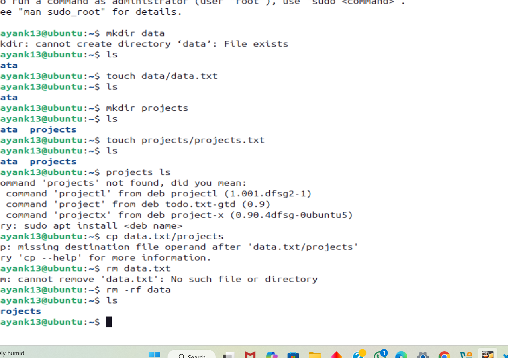

Here's a Markdown (`.md`) file that documents the basic usage of `rm`, `cp`, and `touch`, with a simple example for moving one file to another, and a note about `rm -rf`.

---

### 📄 File: `file_commands.md`

````markdown
# Linux File Commands: `rm`, `cp`, `touch`, `mv`

## 1. `rm` – Remove Files or Directories

### Syntax:
```bash
rm [options] file_name
````

### Common Options:

* `-f` : Force deletion (ignore nonexistent files, never prompt).
* `-r` or `-R` : Recursively delete directories and their contents.
* `-rf` : Combine both to force delete directories and their contents.

### Example:

```bash
rm myfile.txt           # Delete a file
rm -rf myfolder/        # Forcefully delete a folder and everything inside
```

⚠️ **Warning**: `rm -rf` is a powerful and potentially destructive command. Be cautious using it, especially as root.

---

## 2. `cp` – Copy Files and Directories

### Syntax:

```bash
cp [options] source destination
```

### Common Options:

* `-r` : Copy directories recursively.
* `-v` : Verbose output, shows files as they are copied.

### Example:

```bash
cp file1.txt backup.txt             # Copy a file
cp -rv myfolder/ backup_folder/    # Copy a folder recursively and verbosely
```

---


## 3. `touch` – Create Empty Files or Update Timestamps

### Syntax:

```bash
touch file_name
```

### Example:

```bash
touch newfile.txt     # Creates a new empty file named newfile.txt
```

---

## 4. `mv` – Move or Rename Files

### Syntax:

```bash
mv [options] source destination
```

### Example:

```bash
mv oldname.txt newname.txt     # Rename a file
mv myfile.txt folder/          # Move a file to a folder
```

---

## Simple Workflow Example

```bash
touch hello.txt                # Create a new file
cp hello.txt copy.txt          # Make a copy of the file
mv copy.txt folder/            # Move the copy into a folder
rm -rf folder/                 # Remove the folder and everything inside
```

---

## Summary Table

| Command | Purpose              |
| ------- | -------------------- |
| `rm`    | Remove files/folders |
| `cp`    | Copy files/folders   |
| `touch` | Create empty files   |
| `mv`    | Move or rename files |

```

---


```
